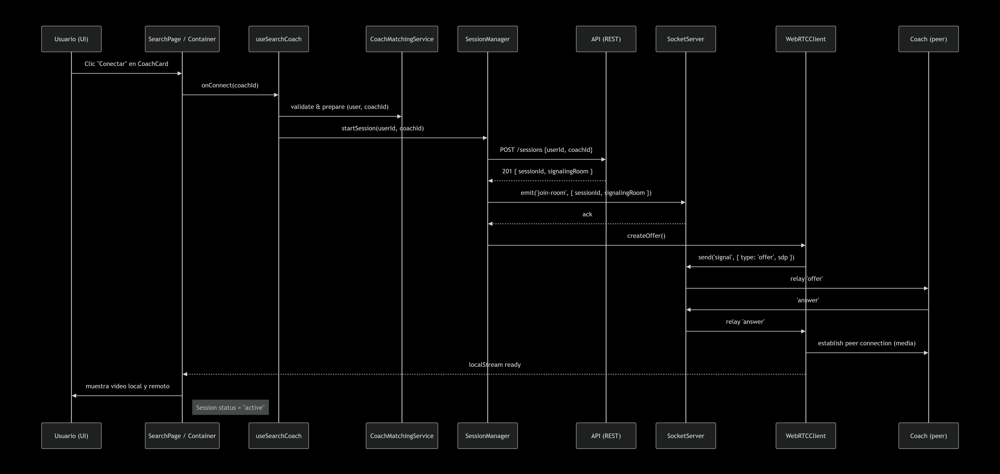
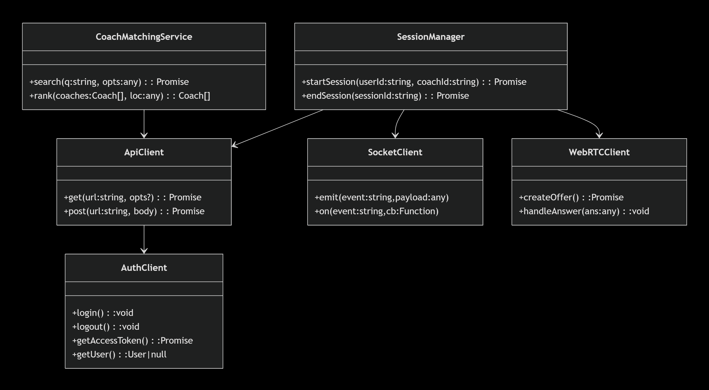

# 20minCoach — Frontend

# 1 - Investigación tecnológica y selección

## 1.1 Objetivo

Seleccionar y justificar las tecnologías principales a usar en el frontend de 20minCoach, considerando requisitos funcionales (video 20min, búsqueda en tiempo real, perfiles, SSR para SEO de perfiles públicos) y no funcionales (seguridad — roles y MFA —, mantenibilidad, testabilidad, despliegue rápido).

## 1.2 Resumen ejecutivo (recomendación)

Stack recomendado (versión corta):

- Framework: Next.js (React) + TypeScript (SSR/SSG cuando aplique)

- UI / estilos: Tailwind CSS (utility-first)

- Estado y fetching: Redux Toolkit + RTK Query

- Tiempo real / video: WebRTC (media) + WebSocket / Socket.io (señalización, presence, notificaciones)

- Auth / Authorization: Auth0 (roles, permisos, MFA)

- Tests: Jest + React Testing Library + MSW (mock APIs). E2E opcional: Cypress.

- Prototipado AI: Framer (por capacidad de exportar React) — alternativa: Figma + Anima (si Framer no está disponible).

- UX testing: Maze o Useberry (Useberry si necesitamos heatmaps integradas).

- Linter / formateo: ESLint + @typescript-eslint + Prettier

- CI/CD: GitHub Actions (lint, test, build) → Vercel para deploy.

## 1.3 Evaluación comparativa (razonada)

A continuación comparo las opciones más relevantes y por qué elegimos la que recomendamos:

## Framework / Meta-framework

- React + Next.js (recomendado)

    - Pros: SSR facil (importante para SEO y para proteger rendering con roles), excelente ecosistema, buen soporte para exportar páginas server-side (Next.js getServerSideProps), facilita integración con Auth0 y Vercel, gran comunidad.

    - Contras: mayor complejidad inicial vs CRA, pero justificada por SSR.

- Vue / Nuxt: buena alternativa, pero en el equipo (por lo general) React/Next tiene mejor interoperabilidad con herramientas de testing y export de prototipos y mayor adopción en empresas.

- Angular: más pesado y opinionado; no aporta ventajas clave para este caso.

Selección: Next.js + React (TypeScript).

## Estilos / Diseño

- Tailwind CSS (recomendado): rápido para prototipado, consistente, facilita dark mode y responsive; mantiene tamaño del bundle bajo si se configura correctamente.

- Styled Components / Emotion: buenas para scoped styles y theming, pero más runtime.

- CSS Modules: OK, pero menos productivo que Tailwind para prototipos rápidos.

Selección: Tailwind CSS.

## Estado / Data fetching

- Redux Toolkit + RTK Query (recomendado): estructura predecible para un equipo; RTK Query simplifica fetching, cache y revalidation; fácil de testear.

- Zustand: ligero y más simple, pero RTK ofrece herramientas (entity adapters, middlewares) que ayudan a escalar.

Selección: Redux Toolkit + RTK Query.

## Real-time / Video

- WebRTC (media P2P): obligatorio para video en vivo. Necesitamos TURN servers para casos NAT/Firewalls.

- WebSocket / Socket.io: señalización de WebRTC, presencia, notificaciones push. socket.io facilita reconexión y eventos; un cliente WebSocket estándar es más ligero.

Selección: WebRTC para media + Socket.io (o ws) para señalización & presence. Proveer TURN (coturn) o proveedor TURN.

## Autenticación / Autorización

- Auth0 (recomendado): provee OIDC, roles, permission management y MFA sin implementarlo desde cero; consola para crear test users y roles; SDK para Next.js.

- Firebase Auth: opción válida pero menor control de roles y permisos organizados.

Selección: Auth0.

## Pruebas & QA

- Unit / components: Jest + React Testing Library.

- API mocks: MSW (Mock Service Worker) para tests y desarrollo aislado.

- E2E: Cypress (opcional para flujo end-to-end: login, inicio sesión WebRTC).

Selección: Jest + RTL + MSW (+ Cypress si hay tiempo).

## UX prototipo & pruebas de usabilidad

- Framer: exporta React, permite generar componentes y prototipos interactivos fácilmente (cumple requisito de “acceso al código”).

- Figma + Anima: alternativa (Figma es popular); Anima ayuda a exportar en React.

- Maze / Useberry para tests: Maze es fácil para tests sin moderador; Useberry ofrece heatmaps — seleccionar según necesidad de heatmaps.

Selección: Framer (prototipo exportable) + Maze (tests); si heatmaps son requeridos, subir prototipo a Useberry o combinar Maze + Useberry.

## Linter & estilo

- ESLint + @typescript-eslint + Prettier: obligatorio para consistencia. Añadir regla custom para prohibir any en /src.

# Diseño de Arquitectura N-Layer

Capas (del exterior al interior):

1. Presentation (Pages / Containers) — rutas Next.js y containers de página.

2. Visual Components (UI) — componentes puros y accesibles (Primitives + Composed).

3. Controllers / Hooks — orquestación entre UI y servicios; validaciones locales; transformar inputs.

4. Business / Domain Services — reglas del negocio: SessionManager, CoachMatchingService.

5. Proxy / Clients / Adapters — apiClient, authClient, socketClient, webrtcClient.

6. Models / DTOs / Validators — tipos, transformaciones y validación (zod).

7. Middleware / Interceptors / Logging — interceptores para requests, manejo de errores y logging.

8. Utilities / Platform — logger, feature flags, storage helpers.

Cada capa debe ser “testable” y “sustituible” mediante inyección de dependencias (factories / providers).

## Mapa a la estructura de carpetas (/src)

```bash
/src
  /pages
    _app.tsx
    /search
      index.tsx
      SearchContainer.tsx
  /components
    /Primitives
      Button/
      Input/
    /Composed
      CoachCard/
      CoachList/
  /containers
    SearchContainer.tsx
    CoachDetailContainer.tsx
  /hooks
    createUseSearchCoach.ts
    useSessionTimer.ts
    useAuthGuard.ts
  /services
    SessionManager.ts
    CoachMatchingService.ts
  /clients
    apiClient.ts
    authClient.ts
    socketClient.ts
    webrtcClient.ts
  /models
    coach.ts
    session.ts
    dtoTransforms.ts
  /validators
    coachValidator.ts
    sessionValidator.ts
  /middleware
    apiInterceptors.ts
    permissionsMiddleware.ts
    errorHandler.ts
    loggerMiddleware.ts
  /state
    store.ts
    slices/
      coachSlice.ts
      userSlice.ts
  /utils
    logger.ts
    events.ts        # pub/sub interno
    time.ts
  /pocs
  /diagrams

```

Regla: un componente = una carpeta.

## Responsabilidades y contrato de cada capa (detallado)

### Presentation (Pages / Containers)

**Responsabilidad**

- Renderizar páginas completas y containers.

- Orquestar componentes visuales y hooks.

- Ejecutar SSR/SSG cuando haga falta (p. ej. getServerSideProps para validación de sesión/roles).

**No debe**

- Hacer llamadas HTTP directas a endpoints ni contener lógica de negocio compleja.

Ejemplo de archivo: src/pages/search/index.tsx (usa SearchContainer)

### Visual Components (UI)

**Responsabilidad**

- Componentes sin efectos secundarios (pure), accesibles, parametrizables por props.

- Recibir data y callbacks; no invocar servicios ni hooks globales.

**Buenas prácticas**

- Cada componente en su carpeta con Component.tsx, Component.test.tsx, README.md.

- Props tipadas y documentadas.

### Controllers / Hooks

**Responsabilidad**

- Manejar la lógica de UI: debounce, validación de inputs, composición de múltiples llamadas, manejo local de estados complejos.

- Exponer una API simple al componente (por ejemplo {query, setQuery, results, loading, error}).

**Patrón recomendado**

- Factory: createUseSearchCoach(service: CoachService) → useSearchCoach.

- Esto permite inyectar CoachService en tests.

Ejemplo de ruta: src/hooks/createUseSearchCoach.ts

### Business / Domain Services

**Responsabilidad**

- Reglas del dominio (no UI): validaciones de negocio, flujos compuestos (startSession), mapping de earnings/ratings, etc.

- Orquestan llamadas a clients (API/Socket/WeRTC) pero no conocen detalles de UI.

**Ejemplo de clases**

- SessionManager:

    - startSession(userId, coachId) : Promise<Session>

    - endSession(sessionId) : Promise<void>

- CoachMatchingService:

    - search(query, filters) : Promise<Coach[]>

    - rank(coaches, userLocation) : Coach[]

**Testing**: estas clases se prueban con mocks de apiClient y socketClient.

### Proxy / Clients / Adapters

**Responsabilidad**

- Encapsular protocolos (HTTP, WebSocket, WebRTC). Contienen interceptors y reintentos.

- Exportar APIs limpias y tipadas.

**Principio**

- Un solo punto para llamadas HTTP (apiClient) con interceptors aplicados.

**Archivos claves**

- src/clients/apiClient.ts (axios wrapper)

- src/clients/authClient.ts (Auth0 wrapper)

- src/clients/socketClient.ts (socket.io client wrapper)

- src/clients/webrtcClient.ts (helper para RTCPeerConnection)

### Models / DTOs / Validators

**Responsabilidad**

- Definir TS types/interfaces.

- Validar respuestas del backend (zod) y transformar DTO -> Model.

**Ejemplo**

- src/models/coach.ts

- src/models/dtoTransforms.ts

- src/validators/coachValidator.ts (zod)

### Middleware / Interceptors / Logging

**Responsabilidad**

- Interceptar requests/responses (token injection, retries).

- Mapear errores a AppError con tipos (ValidationError, AuthError, DomainError).

- Registrar logs estructurados.

**Ejemplos**

- apiInterceptors.ts → inyecta token de authClient, valida DTOs con zod.

- loggerMiddleware.ts → envía errores a Sentry/console según entorno.

## Comunicación entre capas (patrones y mensajes)

- Presentation → Hooks: llamadas síncronas (funciones / props).

- Hooks → Services: llamadas asíncronas (promesas).

- Services → Clients: llamadas HTTP / WebSocket / WebRTC (promesas o callbacks / eventos).

- Clients → Middleware: interceptors que transforman request/response.

- Events internos: Pub/Sub (events.ts) para desacoplar (ej.: EVENT_SESSION_STARTED).

**Mensajería WebSocket (ejemplo de mensajes)**

```json
// Cliente -> Server (señalización)
{ "type": "signal", "action": "offer", "sessionId": "s1", "payload": { "sdp": "..." } }

// Server -> Cliente
{ "type": "session", "event": "started", "sessionId": "s1", "coachId": "c1", "userId": "u1" }
```

## Interfaces / DTOs clave (TypeScript)

```typescript
// src/models/coach.ts
export interface AvailabilitySlot {
  start: string; // ISO
  end: string;   // ISO
}
export interface Coach {
  id: string;
  name: string;
  avatarUrl?: string;
  rating: number; // 0..5
  specialties: string[];
  pricePerSession: number;
  location?: { lat: number; lng: number; city?: string; country?: string; };
  availability: AvailabilitySlot[];
  bio?: string;
}
```

```typescript
// src/models/session.ts
export type SessionStatus = 'scheduled' | 'active' | 'completed' | 'cancelled';
export interface Session {
  id: string;
  coachId: string;
  userId: string;
  startAt: string; // ISO
  durationMinutes: number; // 20
  status: SessionStatus;
  signalingRoom?: string;
}
```

```typescript
// src/models/dtoTransforms.ts
import { Coach } from './coach';
import { z } from 'zod';
import { CoachSchema } from '../validators/coachValidator';

export function toCoachModel(dto: unknown): Coach {
  const parsed = CoachSchema.parse(dto);
  return {
    id: parsed.id,
    name: parsed.name,
    avatarUrl: parsed.avatarUrl,
    rating: parsed.rating,
    specialties: parsed.specialties,
    pricePerSession: parsed.pricePerSession,
    availability: parsed.availability,
    bio: parsed.bio,
    location: parsed.location,
  };
}
```

### Diagrama de secuencia: flujo “Start session”

<div align="center">


</div>

### Diagrama de clases

<div align="center">


</div>

